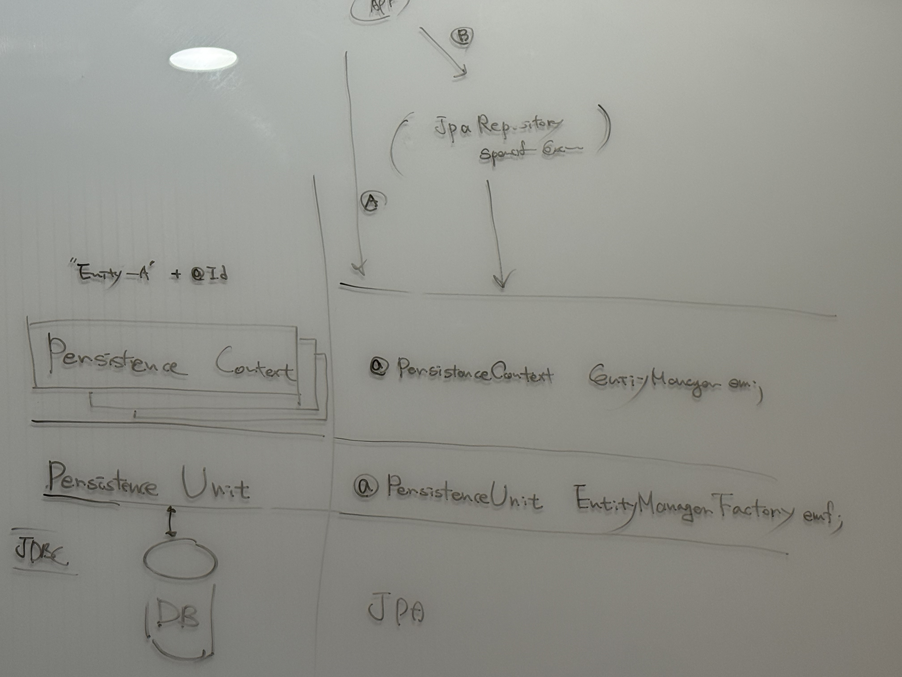

###

| Context                |JPA|
|------------------------|---|
| Persistence Unit       | @PersistenceUnit EntityManagerFactory|
| Persistence Context[*] | @PersistenceContext EntityManager|

> Context - @Entity 당 + @Id 하나

SpringData JPA ...

### FetchType

The EAGER strategy is a requirement on the persistence provider runtime that the associated entity must be eagerly fetched.

The LAZY strategy is a hint to the persistence provider runtime